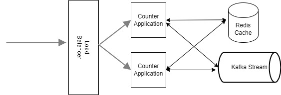

# counter
Counter Application is a spring boot based application running on port 8080 by default.

Rest API exposed is "/api/smaato/accept". 
API accepts query parameters id and endpoint, id is of type Integer and endpoint is optional of type String. Sample url below.

http://localhost:8080/api/smaato/accept?id=123&endpoint=https://6214851389fad53b1f15fc1e.mockapi.io/api/v1/echo

Application is capable to store the number of unique request per minute locally in Map and external store Redis when running in distributed mode
Unique Count of requet is partition by minute "YYYY-MM-DD-HH-MM",sample "2022-02-22-21-50"

Application behviour of local or distributed by application.properties ,key counter possible values local and distributed.
When running in distributed mode Redis host at 127.0.0.1 and port 6379, the host and port and port can be configured externally in application.properties

Publishing of number unquie request per minute is controlled by cron, used spring scheduled task for printing the number of unique request at a interver of a minute.

Application supports publising of unique request number to Logs or Kakfa stream, controlled by applcation.properties, publisher possible value logger and kafka
While running in Kafka publising mode, kafka topic name and boot strap server to be speficied in properties file

